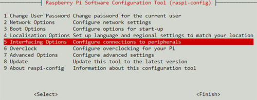
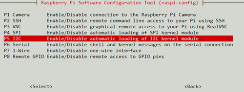

# Настройка проекта для raspberry pi 4

### Калибровка тачскрина дисплея оператора

- Установить пакет xinput-calibrator:
```bash
user@my-pc:~$ sudo apt-get install xinput-calibrator
```
- Просмотреть список подключённых дисплеев (eDP-1 и HDMI-1):
    - Разрешение: 1920x1080 и 1024x600
    - Позиция: 0x0 и 0x1080
```bash
user@my-pc:~$ xrandr | grep ' connected'
eDP-1 connected 1920x1080+0+0 (normal left inverted right x axis y axis) 309mm x 173mm
HDMI-1 connected primary 1024x600+0+0 (normal left inverted right x axis y axis) 255mm x 255mm
```
- Установить название устройства для калибровки ("WaveShare WS170120"):
```bash
user@my-pc:~$ xinput_calibrator --list
Device "WaveShare WS170120" id=9
```
- Выполнить следующую команду для калибровки (со своими значениями):
```bash
xrandr --output "{{название дисплея без тачскрина}}" --off && xinput --map-to-output "{{название тачскрина}}" "{{название дисплея с тачскрином}}" && xinput_calibrator && xrandr --output "{{название дисплея без тачскрина}}" --mode "{{разрешение дисплея без тачскрина}}" --pos "{{название дисплея без тачскрина}}" --rotate normal --output "{{название дисплея с тачскрином}}" --mode "{{разрешение дисплея с тачскрином}}" --pos "{{позиция дисплея с тачскрином}}" --rotate normal && xinput --map-to-output "{{название тачскрина}}" "{{название дисплея с тачскрином}}"
```
- Пример:
```bash
user@my-pc:~$ xrandr --output eDP-1 --off && xinput --map-to-output WaveShare\ WS170120 HDMI-1 && xinput_calibrator && xrandr --output eDP-1 --mode 1920x1080 --pos 0x0 --rotate normal --output HDMI-1 --mode 1024x600 --pos 0x1080 --rotate normal && xinput --map-to-output WaveShare\ WS170120 HDMI-1
Calibrating standard Xorg driver "WaveShare WS170120"
   current calibration values: min_x=0, max_x=65535 and min_y=0, max_y=65535
   If these values are estimated wrong, either supply it manually with the --precalib option, or run the 'get_precalib.sh' script to automatically get it (through HAL).
   --> Making the calibration permanent <--
  copy the snippet below into '/etc/X11/xorg.conf.d/99-calibration.conf' (/usr/share/X11/xorg.conf.d/ in some distro's)
Section "InputClass"
   Identifier   "calibration"
   MatchProduct   "WaveShare WS170120"
   Option   "MinX"   "400"
   Option   "MaxX"   "65039"
   Option   "MinY"   "1338"
   Option   "MaxY"   "66218"
   Option   "SwapXY"   "0" # unless it was already set to 1
   Option   "InvertX"   "0"  # unless it was already set
   Option   "InvertY"   "0"  # unless it was already set
EndSection
```
- Получить список подключённых устройств (это пример, в нашем случае название тачскрина "WaveShare WS170120"):
```bash
user@my-pc:~$ xinput list
⎡ Virtual core pointer                          id=2    [master pointer  (3)]
⎜   ↳ Virtual core XTEST pointer                id=4    [slave  pointer  (2)]
⎜   ↳ SynPS/2 Synaptics TouchPad                id=11   [slave  pointer  (2)]
⎣ Virtual core keyboard                         id=3    [master keyboard (2)]
    ↳ Virtual core XTEST keyboard               id=5    [slave  keyboard (3)]
    ↳ Power Button                              id=6    [slave  keyboard (3)]
    ↳ Video Bus                                 id=7    [slave  keyboard (3)]
    ↳ Power Button                              id=8    [slave  keyboard (3)]
    ↳ HID 413c:8161                             id=9    [slave  keyboard (3)]
    ↳ AT Translated Set 2 keyboard              id=10   [slave  keyboard (3)]
```
- Получить откалиброванныю матрицу для тачскрина:
```bash
user@my-pc:~$ xinput list-props 'WaveShare WS170120' | grep "Coordinate Transformation Matrix"
Coordinate Transformation Matrix (137): 1.000000, 0.000000, 0.000000, 0.000000, 1.000000, 0.000000, 0.000000, 0.000000, 1.000000
```
- Занести в файл calibrate.sh проекта в команду калибровки матрицы изменения, в строку:
```bash
xinput set-prop 'WaveShare WS170120' 'Coordinate Transformation Matrix' 1.000000, 0.000000, 0.000000, 0.000000, 1.000000, 0.000000, 0.000000, 0.000000, 1.000000
```
- Внести файл calibrate.sh в автозапуск raspberry pi 4 /etc/xdg/lxsession/LXDE-pi/autostart
```bash
...
sudo python /path/to/project/main.py
sh /path/to/project/calibrate.sh
```
- Источники
    - [Калибровка](https://wiki.ubuntu.com/X/InputCoordinateTransformation)
    - [Сохранение калибровки](http://forum.amperka.ru/threads/Настройка-сенсора-на-raspberry-pi-4.19787/)

### Установка библиотек

- Включить i2c:
```bash
user@my-pc:~$ sudo raspi-config
```




- Установить пакет MLX90614:
```bash
user@my-pc:~$ sudo apt-get install python-setuptools 
user@my-pc:~$ sudo apt-get install -y i2c-tools
user@my-pc:~$ cd /path/to/project/PyMLX90614-0.0.3
user@my-pc:/path/to/project/PyMLX90614-0.0.3$ sudo python setup.py install
```

- Источники:
    - [Настройка MLX90614](https://circuitdigest.com/microcontroller-projects/iot-based-contactless-body-temperature-monitoring-using-raspberry-pi-with-camera-and-email-alert)


### Подключение периферии к raspberry pi 4:
  
- Подключение производить в соответствии с указанными новерами контактов в constants.py
- При необходимости изменить конфигурацию оболрудования также изменять конфигурацию constants.py
- Проверить канал датчика MLX90614, изменить при необходимости константу TEMPERATURE_SENSOR_CHANNEL в constants.py
    - [Инструкция для проверки](./PyMLX90614-0.0.3/README.md)

- Схема подключения HC-SR04:


- Источники:
    - [Настройка MLX90614](https://circuitdigest.com/microcontroller-projects/iot-based-contactless-body-temperature-monitoring-using-raspberry-pi-with-camera-and-email-alert)
    - [Настройка HC-SR04](https://tutorials-raspberrypi.com/raspberry-pi-ultrasonic-sensor-hc-sr04/)
